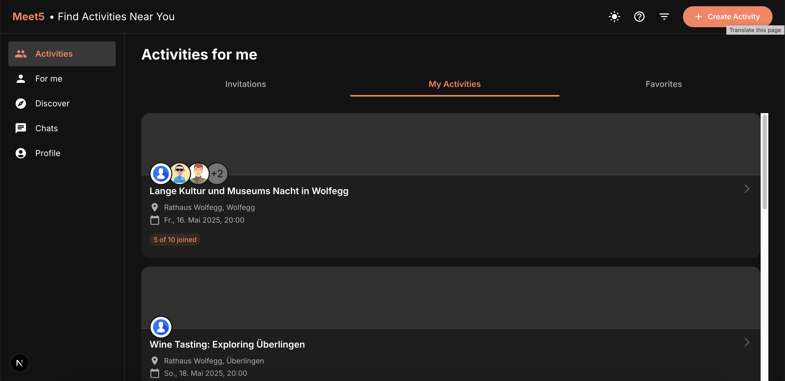
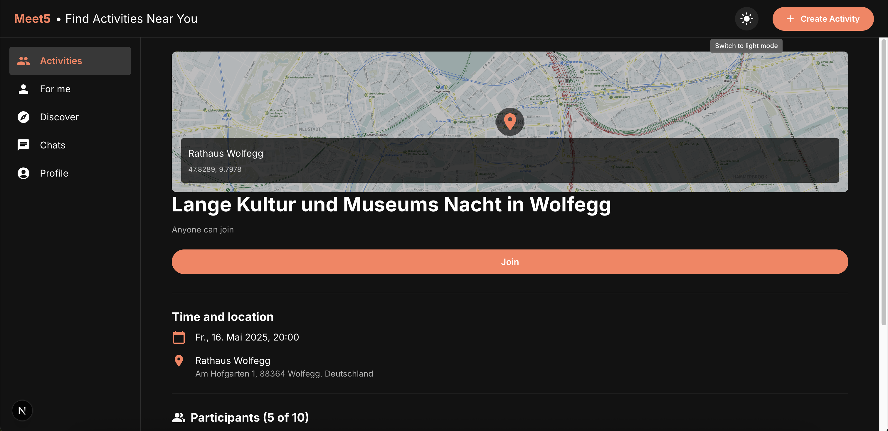
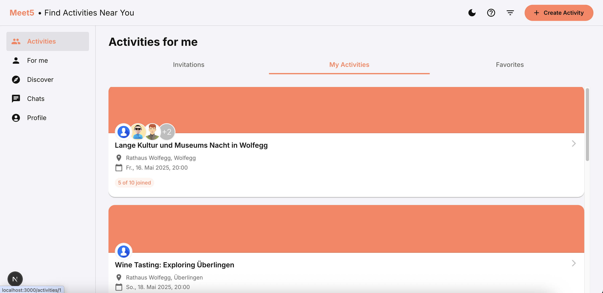
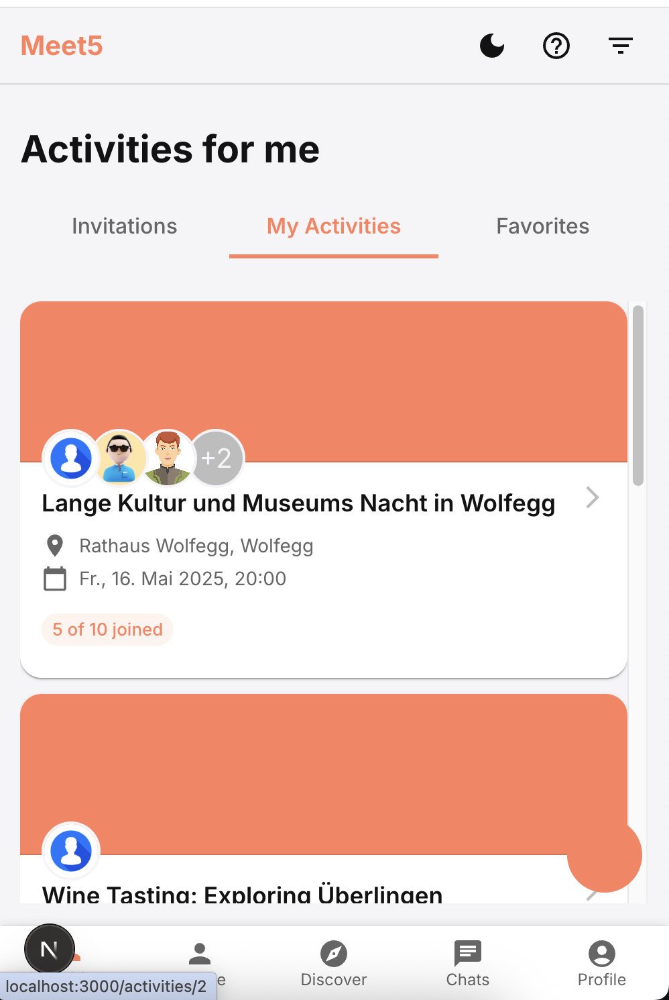

# Meet5 Web Version

A web version of the Meet5 mobile app built with Next.js and Material UI.

## Setup Instructions

1. Clone the repository:

2. Install dependencies:

```bash
npm install
```

3. Run the development server:

```bash
npm run dev
```

4. Open [http://localhost:3000](http://localhost:3000) in your browser to see the application.

## Technologies Used

- Next.js
- Material UI
- TypeScript
- React-Virtuoso for virtual scrolling

## Architecture

This project follows a feature-based architecture with:

- Server components for initial rendering and SEO
- Client components for interactive elements
- Material UI theme customization
- Responsive layout design for desktop and tablet

## Mock Data

The application uses mock data to simulate the API responses. In a production environment, this would be replaced with actual API calls.

## Features

- Activities page with content cards
- Navigation menu (Activities, For me, Discover, Chats, Profile)
- Activity details page with map and participant information
- Responsive design for desktop and iPad
- Virtual scrolling and on demand scrolling for performance optimization
- Dark and light theming support

## SEO Considerations

- Proper semantic HTML structure
- Server-side rendering for critical pages
- Metadata optimization for search engines

### Activities



### Activity Details



### Light Theme



### Responsive


